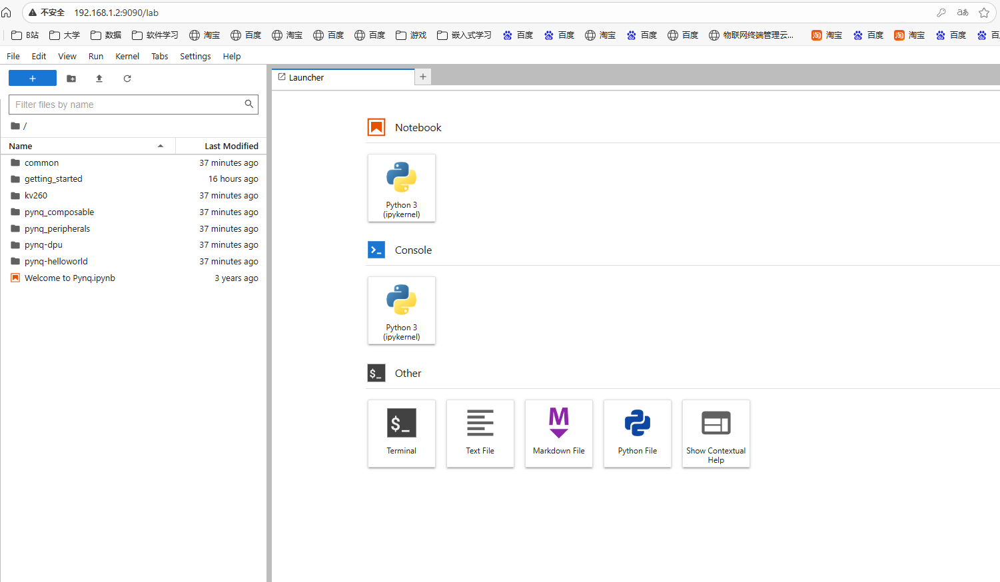

# Tutorial of activation accelerator

This tutorial will introduce how to design an activation accelerator using hls, and how to load IP to run it on the kv260 SoM kit with PYNQ.

The full flow can be divided into four steps: Generate HLS IP, Generate bitstream, PYNQ environment setup, Verification with PYNQ.
Executing these four steps in sequence will allow you to successfully run the baseline version.

The baseline version is based on Vitis HLS 2022.2.

## Generate HLS IP

The source files of activation accelerator baseline version and the tcl script are stored in `prj/baseline/kernel_hls`

```
|____run_hls.tcl
|____activation_accelerator.cpp
|____activation_accelerator.h
|____testbench.cpp
```

1. run_hls.tcl
   You can run the script  `run_hls.tcl` to run simulation, synthesis, co-simulation and exportRTL.
   Generally, the GUI flow includes create project, ad source files, add testbench, select kv 260 SoM Kit, CSim, CSyn, CoSim and Export RTL.
2. activation_accelerator.cpp and activation_accelerator.h
   These two files implement the activation functions, the function has conifg from 0-6, which means eltwiseadd, Safe Softmax, masked Safe Softmax, Sigmoid, SiLU, RMSNorm and LayerNorm.
   Attention, Safe Softmax and masked Safe Softmax should be implemented by youself, the baseline versions of these two activation functions only use placeholders.
   And all hls computations of these activation baseline are float, although the input and output are bfloat16.

The data files for testbench are stored in `/prj/data`.

Before you start the step '**Generate HLS IP', you need to setup the right vitis environment by**

```bash
source /tools/Xilinx/Vitis/2022.2/settings64.sh ## path /tools is where you install xilinx tools
```

And then, run

```bash
cd prj/baseline/kernel_hls
vitis_hls -f run_hls.tcl
```

The need files will be generated in the right location -- `/prj/baseline/kernel_hls/activation_accelerator/baseline/impl/ip` -- for the next step's script -- `Generate bitstream: /prj/baseline/overlay/ run_vivado.tcl`

By the way, you can also use GUI to get the same outcome. Generally, the GUI flow includes create project, ad source files, add testbench, select kv 260 SoM Kit, CSim, CSyn, CoSim and Export RTL.
You need to ensure all steps passed whatever linux tcl or GUI flow.

## Generate bitstream

In linux tcl flow, you can use only one script to generate correct bitstream if you have done the IP core correctly. The script is stored in `/prj/baseline/oberlay_vivado/run_vivado.tcl`.

Run

```bash
cd /prj/baseline/oberlay_vivado
vivado -mode batch -source run_vivado.tcl
```

This script will run ip core load, create block design, HDL wrapper generation, synthesis, implementation and generate bitstream, `.bit ` and `.hwh` files will be put in `/prj/baseline/overlay_vivado`.

Similarly, you can also use GUI to generate bitstream.

## PYNQ environment setup

### Hardware preparation

1. kv 260 SoM Kit
2. PC and Ethernet cable
3. MicroSD Card > 16GB

### Install ubuntu 2204 in kv 260

Select 2204 LTS，download 2204 LTS Image for kv260：[Install Ubuntu on AMD | Ubuntu](https://ubuntu.com/download/amd)

Run the image burning software **balenaEtcher** as administrator, burn the downloaded 2204 LTS image onto the pre-prepared MicroSD card, insert the card into the SD card slot of the KV260 board after burning, connect the power supply, and link the network cable to the router.

The Ubuntu system comes with the **SSH** remote connection service enabled by default after burning.

Initial Password is `ubuntu`，you should change the default password once the first time you login in.

### Install PYNQ

Firstly, you need to solve network, set up a global internet access environment

```bash
git clone https://github.com/Xilinx/Kria-PYNQ.git
cd Kria-PYNQ/
sudo bash install.sh -b  KV260
```

> The `install.sh` script often disconnects during normal operation, so it is recommended to install a proxy tool. You may refer to the following website for guidance, and note that the ARM version should be installed in kv260.

### Open Jupyter

Open JupyterLab from `<ip_address>:9090/lab` or `kria:9090/lab` on browser.
Password is `xilinx`


### Overlay test

At the end of build, a self test script will be generated for every board. This script will run some overlay test.

If you want to run self test, please relocate  `Kria-PYNQ` install path and run

```bash
sudo ./selftest.sh
```

## Verification with PYNQ

### Load and verify IP

1. Copy `.bit` and `.hwh` files onto board ( You can find these files in `prj/overlay_vivado` after you generate bitstream).
   You need to ensure these two files( `.bit` and `.hwh` ) same path and same name.
2. Load overlay on board using Python

   ```python
   from pynq import Overlay
   overlay = Overlay('/root/jupyter_notebooks/aru_sample_wrapper.bit'
   ```
3. Check overlay

   ```python****
   help(overlay)
   ```

   
4. Check IP core
   Get the ip from overlay, which is called `activation_accelerat_0` for call

   ```
   activation_accelerator_ip = overlay.activation_accelerat_0
   ```
5. Read the .rpt report generated by HLS and configure the offset inputs and outputs for the IP core.
   The physical address is typically 64-bit, while the AXI-Lite register can only write 32 bits at a time.
   Therefore, in the baseline, the input and output addresses are split into in0(0x10, 0x14)  in1(0x1c, 0x20)  out\_r(0x28, 0x2c).
   In addition to input and output, other interfaces for related parameters, such as config ans stage, should also not be ignored.

### PYNQ: Call and test IP

You can design the call and test script as the following architecture.

```Plain
load bf16 data from bin # Include in0，in1，golden_out
allocate in0, in1, out
activation_accelerator(in0.physical addr)
activation_accelerator(in1.physical addr)

set activation_accelerator.stage = 0
activation_accelerator.start() # Start data trans
while(activation_accelerator.done() != 1)  # Wait data

set activation_accelerator.stage = 1 # Switch to compute mode
total_time = 0
for i in range(6):
    set activation_accelerator.config = i # Config different activation fucntion
    start time = time()
    activation_accelerator.start() # Start to compute
    while(activation_accelerator.done() != 1) 
    end time = time()
    total_time += (end - start)

    set activation_accelerator.stage = 2 # Switch to data trans
    activation_accelerator.start() # Start to data trans
    while(activation_accelerator.done() != 1) 

    compare(golden_out，out) #
```

Related baseline PYNQ test can be found in `activation_acc/notebook`

## Reference

[Getting Started with Certified Ubuntu 22.04 LTS for Xilinx Devices - Xilinx Wiki - Confluence](https://xilinx-wiki.atlassian.net/wiki/spaces/A/pages/2363129857/Getting+Started+with+Certified+Ubuntu+22.04+LTS+for+Xilinx+Devices) \
[Clash for Ubuntu Tutorial | Devpn Got Freedom](https://devpn.github.io/docs/start/ubuntu/clash/)
